## `[ INCIDENT SUMMARY ]` Operator Profile

| FIELD | VALUE |
|:--|:--|
| **Operator** | Naroju Chiranjeevi (NChiranjeevi) |
| **Role** | Associate IT Support Engineer, Cybersecurity Operations |
| **Scope** | 24/7 SIEM monitoring across a 30,000+ device BFSI fleet |
| **Domains** | SOC operations, incident response, IAM and access control, vulnerability and patch management |
| **Location** | Hyderabad, Telangana, IN |
| **Status** | 🟢 Open to Security Analyst, SOC Analyst, IAM and Information Security Analyst roles |

## `[ SOC DASHBOARD ]` Operational Footprint

## `[ PIPELINE ]` How an Alert Gets Closed

## `[ TOOLING ]` Full Stack

| DOMAIN | STACK |
|:--|:--|
| **SIEM and Monitoring** |       |
| **IAM and Access Control** |     |
| **Detection and IR** |        |
| **EDR and Security Tools** |        |
| **Vuln and Patch Mgmt** |     |
| **Systems and Remote** |       |
| **Networking** |     |
| **Databases** |    |
| **ITSM and Reporting** |    |

## `[ SERVICE RECORD ]` Experience

| PERIOD | ROLE | ORG | OPERATIONS |
|:--|:--|:--|:--|
| Nov 2025 - Present | Associate IT Support Engineer, Cybersecurity Operations | iVIS International Pvt Ltd | 24/7 SIEM monitoring, 50+ daily alert triage, IAM and TOTP MFA reviews, patch and vulnerability management on a 30,000+ device fleet, MySQL/MariaDB configuration validation |
| Sep 2025 - Nov 2025 | Monitoring L1 Trainee | iVIS International Pvt Ltd | Real-time SIEM monitoring, alert triage and escalation per SOC runbooks |
| Mar 2025 - Aug 2025 | Software Engineer Intern, Application Security | Alluxis Technologies | Secure coding and access management controls in the SDLC, Salesforce CRM data protection |

## `[ CREDENTIALS ]` Certifications

| CREDENTIAL | ISSUER | DATE |
|:--|:--|:--|
| Cisco Certified Ethical Hacker | Cisco Networking Academy | Jun 2026 |
| Google Professional Cybersecurity Certificate | Google / Coursera | Jul 2024 |
| IBM Cybersecurity Analyst Professional Certificate | IBM / Coursera | Jun 2024 |
| ISC2 Candidate Badge | ISC2 | Nov 2025 |
| Deloitte Australia Cyber Job Simulation | Forage | Jun 2025 |
| J.P. Morgan and Tata Group Cybersecurity Job Simulations | Forage | Aug 2024 |

## `[ ACTIVE OPS ]` Lab Roadmap

- [x] SIEM monitoring and alert triage
- [ ] Splunk SPL detections: brute force, impossible travel, suspicious PowerShell
- [ ] Wazuh home lab with custom rules mapped to MITRE ATT&CK
- [ ] PCAP write-ups with Wireshark: C2 beaconing, DNS tunneling, phishing
- [ ] Incident report templates and vulnerability triage playbook

## `[ CASE FILES ]` Featured Repositories

| REPO | SUMMARY | STACK |
|:--|:--|:--|
| [`soc-detections`](https://github.com/NChiranjeevi6/soc-detections) | SPL and Sigma detection rules with ATT&CK mapping | Splunk, Sigma |
| [`wazuh-homelab`](https://github.com/NChiranjeevi6/wazuh-homelab) | Lab build notes, agents, custom rules | Wazuh, Linux |
| [`ir-playbooks`](https://github.com/NChiranjeevi6/ir-playbooks) | Triage checklists and incident report templates | IR, ITSM |

Replace with real repos as you publish them. Delete any row you have not built yet.

## `[ ACTIVITY LOG ]` Contribution Trace

## `[ COMMS ]` Open Channels

<!-- Add portfolio badge here when ready:
 -->

  

